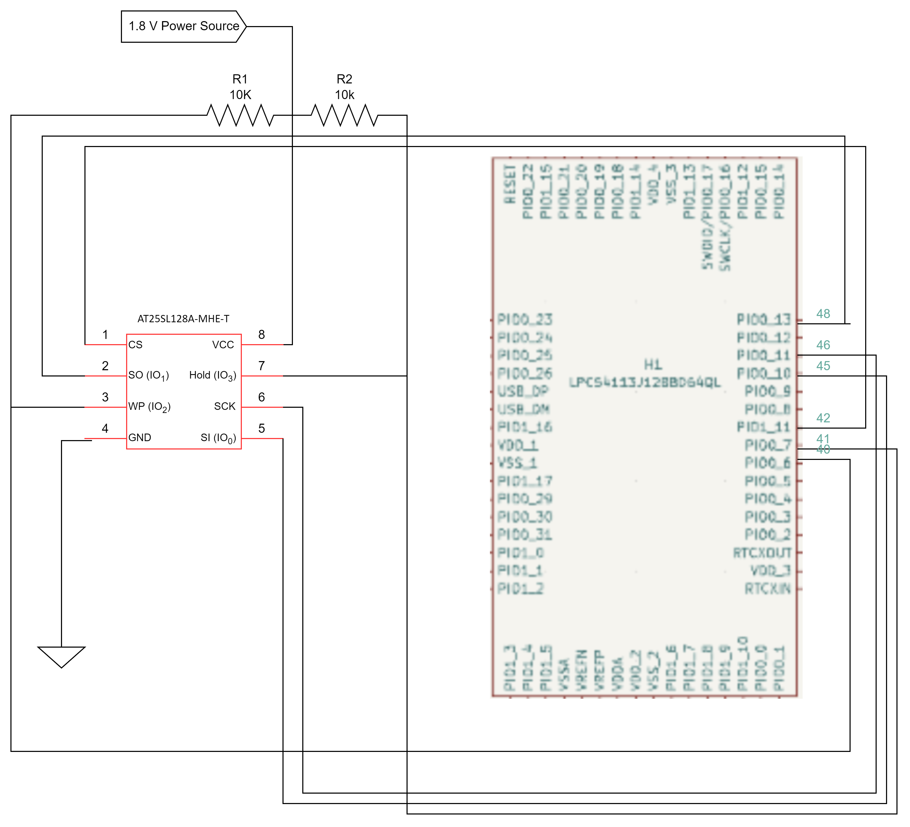

# Memory Subsystem

## Memory Schematic

## Memory chip
#### Component
AT25SL128A-MHE-T
* [Digikey Link](https://www.digikey.com/en/products/detail/adesto-technologies/AT25SL128A-MHE-T/6827494)

#### Relevant Specs
* Operates up to 133Mhz
* SPI support
* Size of memory
* Size of package

#### Analysis
The device was chosen and verified to work based on these standards
* 133 MHz clock speed
    * This clock speed will be able to keep up with the microcontroller.
* Capable of SPI communication
    * Memory needs SPI to communicate with the microcontroller.
* 128 Mb of FLASH memory
    * The chip can Read/Write up to 2 bytes per 150 microseconds of information, so can easily store all the data sent to it.
* Package size of 5 x 6 x 0.6 mm
    * Since the size constraint for the hight is 1' the package size was one of the main constraints of the chip, as it is the size is the smallest found with the minimum storage capacity of 100Mb.
