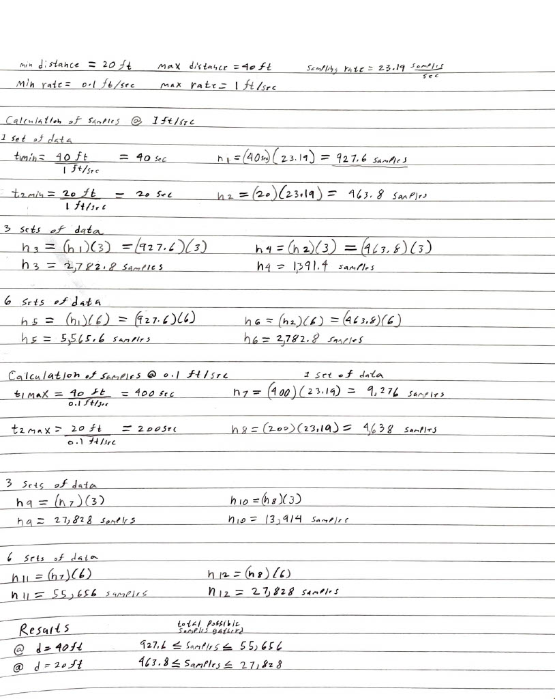
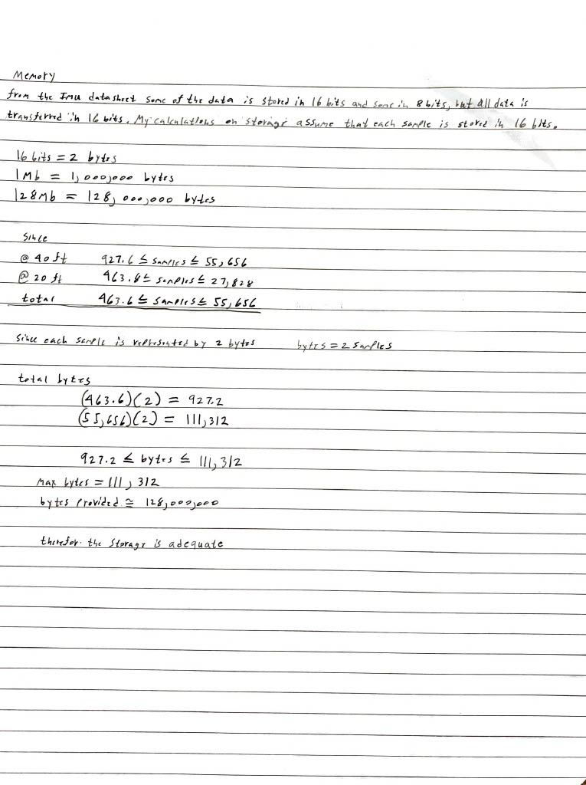

# Memory Subsystem

## Memory Schematic

## Memory chip
#### Component
AT25SL128A-MHE-T
* [Digikey Link](https://www.digikey.com/en/products/detail/adesto-technologies/AT25SL128A-MHE-T/6827494)

#### Relevant Specs
* Operates up to 133Mhz
* SPI support
* Size of memory
* Size of package

#### Analysis
The device was chosen and verified to work based on these standards
* 133 MHz clock speed
    * This clock speed will be able to keep up with the microcontroller.
* Capable of SPI communication
    * Memory needs SPI to communicate with the microcontroller.
* 128 Mb of FLASH memory
    * The chip can Read/Write up to 2 bytes per 150 microseconds of information, so can easily store all the data sent to it. The calculations that proved this are found below, 
      * These calculations are determining the number of samples (data points) taken by the system. There are two separate calculations, as our estimated pipe length will be between 20 and 40ft, on top of those calculations I calculated multiple sets of data, up to 6 sets per length of pipe, and for two separate speeds, 1ft/sec and 0.1ft/sec.
        
      * These calculations are to determine that the memory size of the chip meets/exceeds the number of samples, as each sample is stored and sent in either in a single byte or two bytes. For the calculations I assumed each sample was stored and sent in two bytes so the estimated size required will be larger than what is needed, The maximum sample size was taken from Figure 1 calculations and multiplied by the number of bytes to obtain the bytes of memory required. this figure also shows the breakdown of how many bytes are in the chip, to easily compare whether the chosen storage size meets/exceeds expectations, and they do as the maximum number of bytes required are 111,312 bytes and the memory size is approximately 128,000,000 bytes. 
     
* Package size of 5 x 6 x 0.6 mm
    * Since the size constraint for the hight is 1' the package size was one of the main constraints of the chip, as it is the size is the smallest found with the minimum storage capacity of 100Mb.
