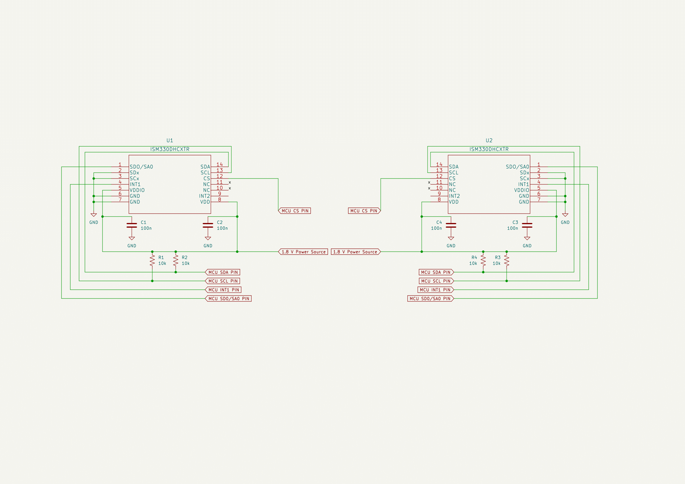
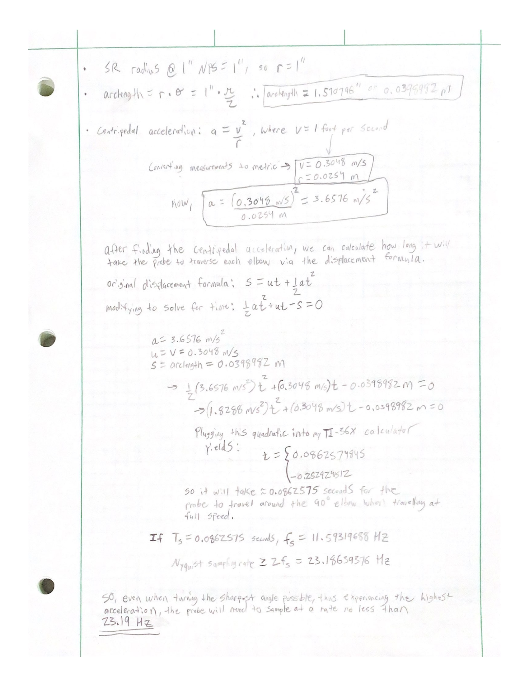
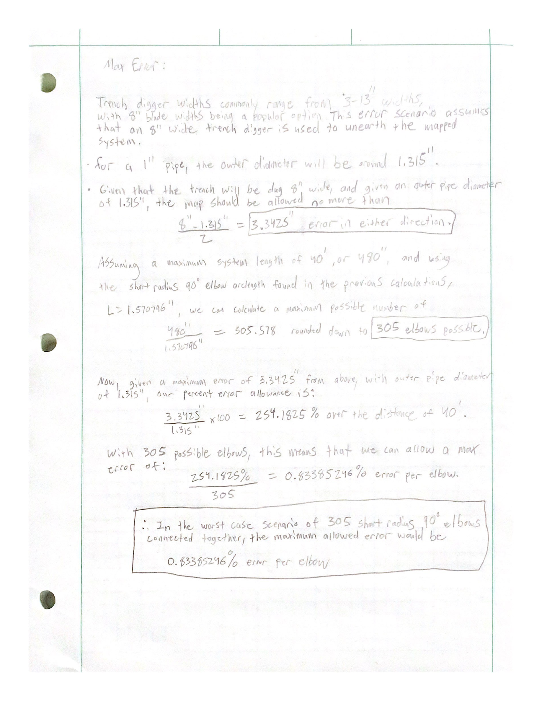

# IMU Subsystem

## IMU Schematic

## IMUs
#### Component
ISM330DHCXTR
* [Digikey Link](https://www.digikey.com/en/products/detail/stmicroelectronics/ISM330DHCXTR/10409727)

#### Relevant Specs
* 6-axis accelerometer, 6-axis gyroscope, and temperature sensors
* SPI and I2C support
* Small package (LGA-14), which is necessary due to the size constraints of the pipe's inner diameter 

#### Analysis
The IMUs were chosen and verified to work based on these considerations
* General Sampling Rate Analysis
    * While the team did not initially specify a required sampling rate for the device, the device will need to be capable of sampling fast enough to ensure that positional data remains as accurate as possible. The calculations made for the required sampling frequency are shown below. The possible output data rates of the accelerometers range from 1.6 Hz to 6.67 kHz, while the output data rates of the gyroscopes range from 12.5 Hz to 6.67 kHz. Given that the physical mapping environment is relatively linear by nature, and the team plans to pull the probe through at a maximum rate of 1 foot per second, this range of sampling rates will be plenty high enough to obtain accurate mapping data.

* Worst Case Sampling Scenario (encountering short radius 90° angles at maximum traversal speed)
   * All 90° elbows referred to in the subsequent calculations are the SR (short radius) variety, as this will result in a shorter elbow arclength as opposed to LR (long radius) elbows. Note that LR elbows are the standard variety of pipe elbow, but in this interest of calculating a worst case sampling scenario, short radius elbows will be used in these calculations. 
   * The interior diameter of the pipe network is equal to 1" 
   * The probe will be pulled though the network at the maximum rate of 1 foot per second
   * The calculations for this scenario are attached at the bottom of the README
    
## Sampling Calculations

## Worst Case Scenario Sampling Calculations

