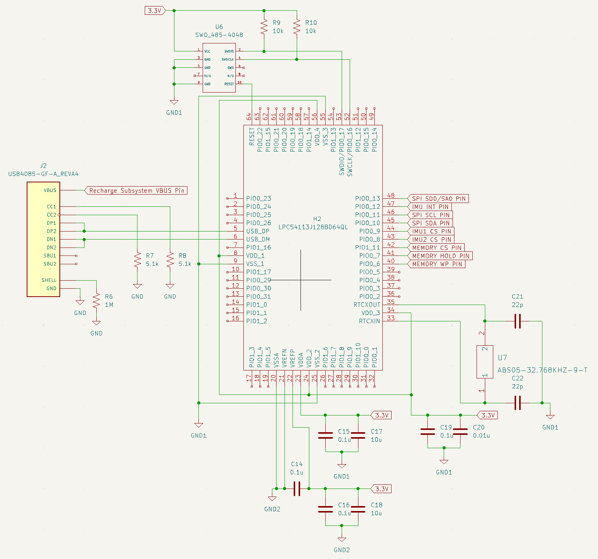

# Microcontroller Subsystem

## Microcontroller Schematic

## Microcontroller
#### Component
LPC54113J128BD64QL
* [Mouser Link](https://www.mouser.com/ProductDetail/NXP-Semiconductors/LPC54113J128BD64QL?qs=45Avz0nZxhtx28X6DfvU%252Bg%3D%3D)

#### Relevant Specs
* Dual Processor Cores operating at 150 MHz
* SPI, I2C, USART, and USB 2.0 support
* 48 GPIO pins

#### Analysis
The device was chosen and verified to work based on these standards
* Capable of SPI communication
    * Memory and the IMUs both need SPI to communicate.
* 32 bit device with 48 GPIO pins
    * The IMU data will be collected at 16 bits per sample so 32 bits will be more than enough to handle the IMU data and the memory size.
* Capable of USB communication
    * This chip has special pins built for USB communication which will make designing easier
* 150 MHz clock speed
    * The IMUs have the ability to store 3 KB (9 KB if compressed) of measurement data in a buffer. If the IMU is collecting 16 bit information at 104 Hz (which is the start testing frequency) it will have about 15 seconds before the buffer is filled and data is overwritten. SPI is capable of data rates up to 60 Mbps. This would allow us to set the clock to a KHz speed and pull the buffer data in about 1 second. The storage chip can also run at up to 60 MB/s. This would allow the chip to run at a low power clock speed and still be able to keep up with the recorded data. In summary, this chip has the necessary clock speed to handle and communicate modes to properly handle the data input rate.
* 192 KB SRAM
    * Each chip can output up to 9 KB of information from a full, fully compressed buffer. Even if the chip cannot immediately store the data it received there is more than enough memory to handle both IMUs. The only scenario in which we would have a problem is if there is an error sending data to the memory chip and we cannot offload any data during the entire process of the measurement.

## Oscillator Chip
#### Component
ABS05-32.768kHz-6-T
* [Mouser Link](https://www.mouser.com/ProductDetail/ABRACON/ABS05-32.768kHz-6-T?qs=XAiT9M5g4x8nsBWAGyPFJQ%3D%3D)

#### Relevant Specs
* 32.768 kHz Frequency
* 6 pF Load Capacitance
* -40 C Minimum Operating Temperature
* +85 C Maximum Operating Temperature
* Length 1.6 mm
* Width 1 mm
* Height 0.5 mm

#### Analysis
* 32.758 KHz
    * This was specified by the datasheet of the microcontroller.
* Capacitor values
    * The microcontroller datasheet strongly recommended the capacitor values follow the equation 2 * (oscillator load capacitance) - (capacitance of the microcontroller pins). The microcontroller pin capacitance was given at about 3 pF. The oscillator load capacitance was given at 12.5 pF. The final value of the capacitors were 22 pF. 
* Operating Temperature
    * The device can run with clean waveforms from –24 to 85 degrees Celsius. This should be perfectly acceptable for our operations. 

## SWD Connector
#### Component
485-4048
* [Mouser Link](https://www.mouser.com/ProductDetail/Adafruit/4048?qs=vLWxofP3U2w8elR0g2xP%252BA%3D%3D)

#### Relevant Specs
* 6.1 mm x 6.0 mm x 5.0 mm

#### Analysis
* Size Constraints
    * The size constraints for the SWD connector were the smallest possible.

## USB C Connector
#### Component
640-USB4085-GF-A
* [Mouser Link](https://www.mouser.com/ProductDetail/GCT/USB4085-GF-A?qs=KUoIvG%2F9Ilba1bQOahfWjw%3D%3D)

#### Relevant Specs
* Standard USB 2.0
* Type C
* Current Rating 3 A
* 8.94 mm x 9.17 mm

#### Analysis
* Size Constraints
    * The size constraints for the USB connector fit our size specifications