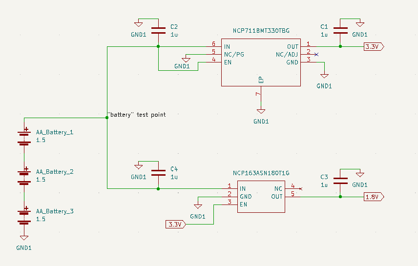
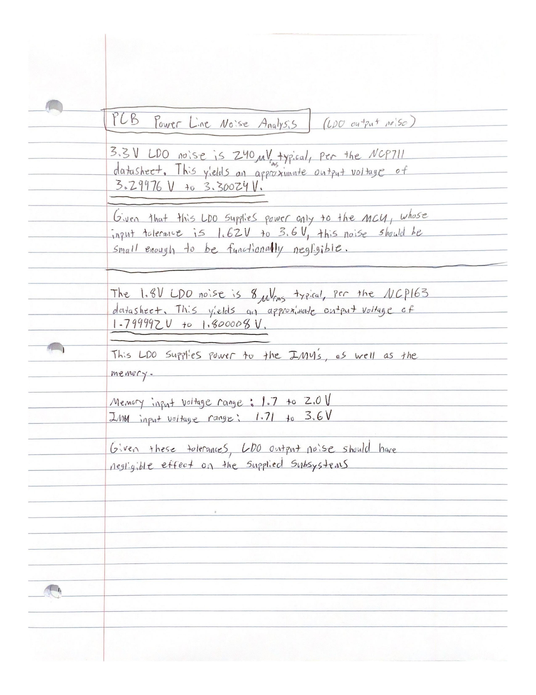
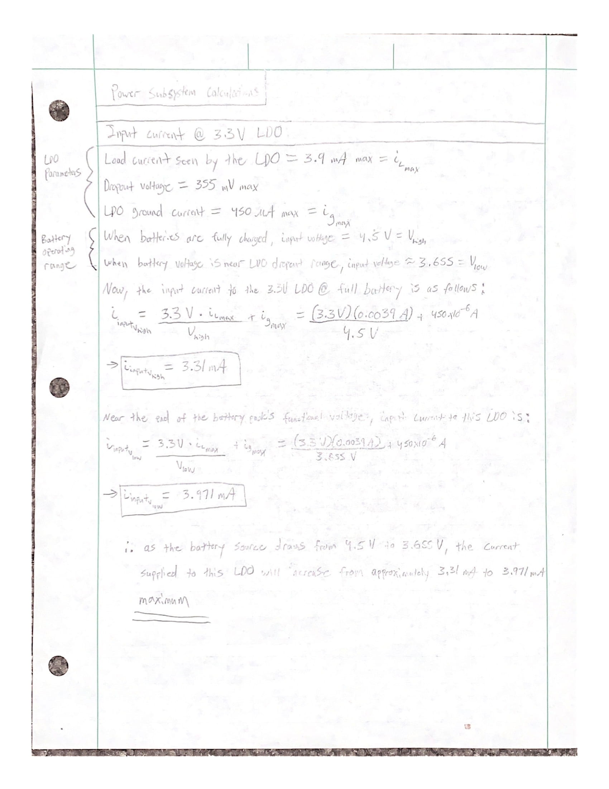
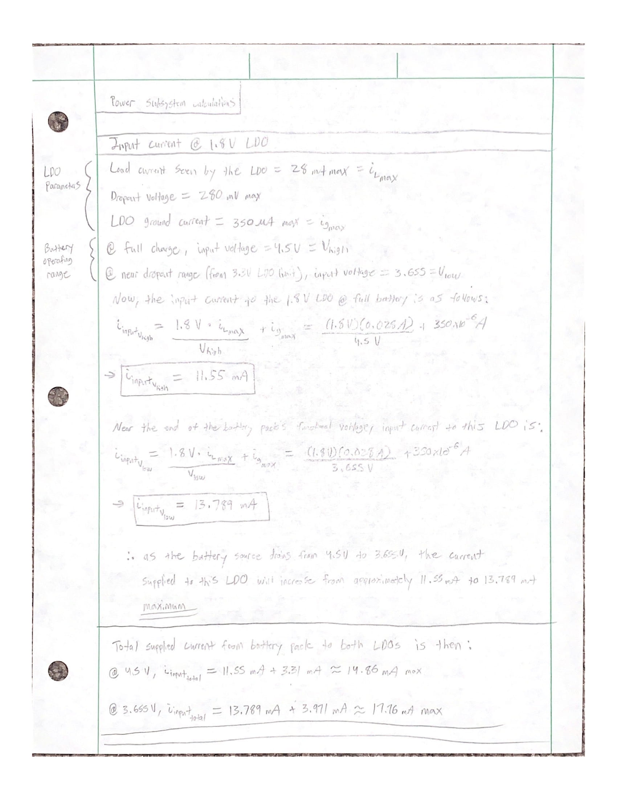

# Power Subsystem

## Power Subsystem Schematic

## LDOs
#### Components
NCP163ASN180T1G (1.8V LDO)
* [Mouser Link](https://www.mouser.com/ProductDetail/onsemi/NCP163ASN180T1G?qs=vLWxofP3U2z0o2tJM%252BNAYw%3D%3D)  

NCP711BMT330TBG (3.3V LDO)
* [Mouser Link](https://www.mouser.com/ProductDetail/onsemi/NCP711BMT330TBG?qs=sGAEpiMZZMug9GoBKXZ751mAF56Mq1BpxK00NF4Cb7BYYrbTvFog%252BQ%3D%3D)

#### Relevant Specs
* Low dropout voltage, suitable for battery
* Minimal output noise
* Small package sizes, which are necessary due to the size constraints of the pipe's inner diameter 

#### Analysis
The LDOs were chosen and verified to work based on these considerations
* Output noise analysis
    * The LDO output voltage noise was calculated using the "Output Voltage Noise" parameters found in each LDO datasheet, and evaluated against each supplied subsystem's input . The output noise from these regulators was found to be functionally negligible, and should not impact system performance.
    * The calculations for the noise analysis are attached at the bottom of the README.
    
* Input Current Analysis
   * Another crucial step in designing the power subsystem was understanding how much current needed to be supplied by the batteries. In an attempt to ensure that we didn't underestimate the device's potential current draw, we based the calculations on each supplied subsystem's maximum current draw rather than each subsystem's nominal current draw. 
   * The calculations for the maximum current supplied to each LDO regulator are attached at bottom of the README.

* Battery Runtime Analysis
   * In our project proposal, we specified that the battery should be able to power the device long enough to map 5,000 feet of pipe before battery replacement was necessary. 
          * Given that our probe speed has been defined in our previous documents as 1 ft/s,  a total of 5,000 ft of pipe would take 5,000 seconds, or 83.33 minutes of runtime. 
          * Alkaline AA batteries typically have a capacity rating between 2000-3000 mAh, with 2500-2850 mAh being a more common range when under 50 mA constant drain. To account for the case of lowest normal capacity, we'll assume the battery pack only has a capacity of 2000 mAh at <50 mA constant drain. 
          * Given a total maximum supplied current of around 17.76 mA, the potential battery life would generally be around: 2000mAh/17.76mA = 112.6 hours.
          * However, it should be noted that this estimation will vary depending on factors such as the specific discharge characteristics of a given battery, operating temperature, and actual load current, which will vary based on both device operations as well as battery voltage. For this device, we must also specifically account for the dropout voltage of the LDOs. The relevant dropout voltage we must consider is that of the 3.3V LDO, which is 355 mV maximum. In order for the LDO to supply a stable 3.3V to the MCU rail, the LDO input voltage will need to stay above roughly 3.655V. This means that the device may not function for the full life of the battery, but only up until each battery has dropped to around 1.22V. Given that alkaline AA batteries can often drop as low as 0.8V before they are totally discharged, it must be noted that the device will most likely stop working due to insufficient power before the batteries have been fully drained. 
          * For the sake of meeting our specifications however, it appears that this battery system will be more than capable of meeting our original runtime requrement of 5,000 ft worth of pipe, or 83.33 minutes, even assuming that the batteries will only be functional until the point that their total voltage is 3.665V. At a maximum total current drain of around 17.76 mA, the manufacturer discharge curves of a regular Duracell Coppertop AA battery indicate that their AA batteries could provide over 100 hours of service time by the time that they discharge to 1.22V. This runtime far exceeds our goal of roughly 1 hour and 23 minutes of runtime. 
    
## Output Noise Analysis

## 3.3V LDO Input Current Analysis

## 1.8V LDO Input Current Analysis

