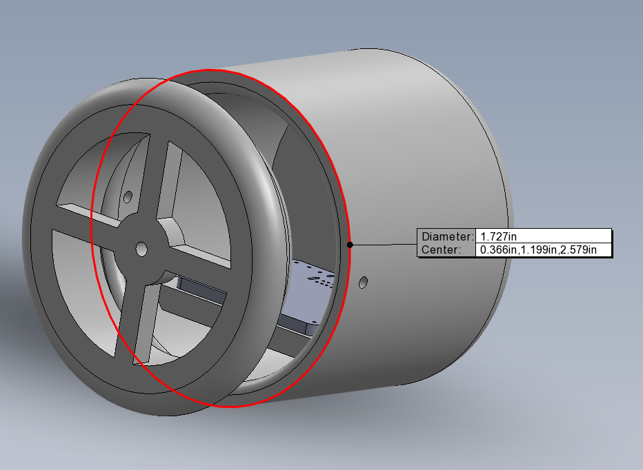

# Probe Casing Subsystem

## Probe Casing Schematic

## Overall Design
The probe casing system has been 3D modelled below. The larger cylinder is for the PCB and the smaller cylinders have each been custom designed to fit a battery holder  
(linked above). Holes have been put into each end of the casings one for the wires and one for the screw eyelets. The screw eyelet holes have been custom designed to fit 
the screw eyelets linked above. The casings will be connected together via fishline which will be tied between the casings so as to not put tension on the 
electrical wires. The casings will then be connected via fishline to the reeling system which will pull it through the PVC piping. Each of these casings can be 
3D printed in the iCube and used immediately. Because the PCB case is almost 2" in diameter it will not be able to fit in the 1" PVC pipe but should still 
easily fit in any PVC 2" and above which meets our requirement of 2"-4" PVC.

## PCB Casing
#### Component
Custom PCB Case
* [Design Link](PCB Carrier.SLDPRT)

#### Relevant Specs
* Custom fit to PCB at 1.727" diameter and 1.476" length

#### Analysis
* The PCB casing was made as a cylinder to minimize friction inside the pipe while having a flat interior setting in order to cradle the PCB with minimal jostling.  
The larger cylinder for the PCB is 1.476" in diameter which will easily fit the 1" wide PCB. Glue will be used to secure the PCB to the interior of the casing. 
The cap for the casing is easily secured and removed via set screws in the side of the casing allowing for easy removal of the cap for connection with the USB onboard 
the PCB. The openings in the casing are for the batteries to be easily wired into the PCB when being set to use. There is also a screw eyelet hole that has been made 
custom to the one linked above. 

## Battery Case
#### Component
Custom Battery Case
* [Design Link](Battery Carrier.SLDPRT)

#### Relevant Specs
* Custom built to fit the battery casings with 1.125" diameter and 2.248" length

#### Analysis
* The battery casing was made in the same fashion as the PCB casing to minimize friction inside the pipe while having a custom interior built for the battery holder linked above which is 2.248"x0.669"x0.539". The interior of the cylinder has a diameter of 0.875" which should easily fit the battery holder and it has an interior length of 2.5" which also fits the length of the battery holder. The cap for this casing will also be easily removable using a set screw in the side of the casing/cap to allow for easy replacement of batteries.

